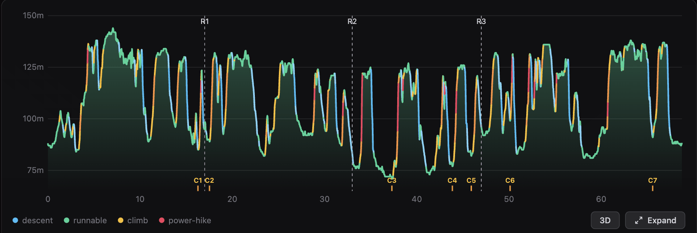
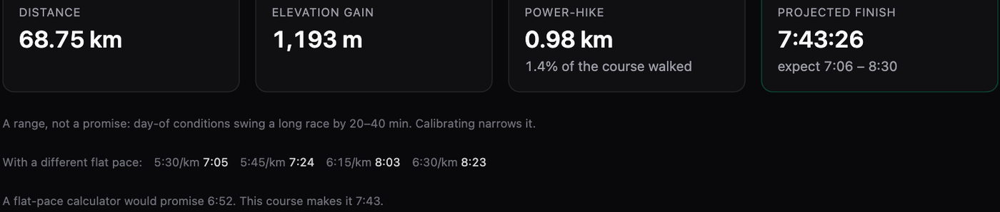
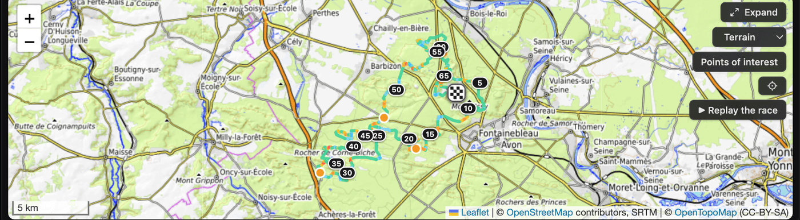
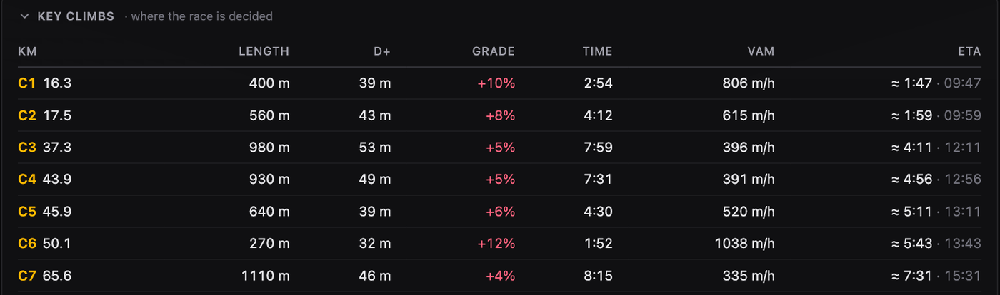
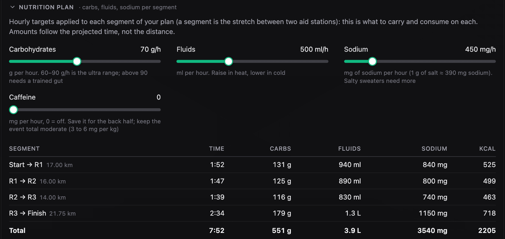
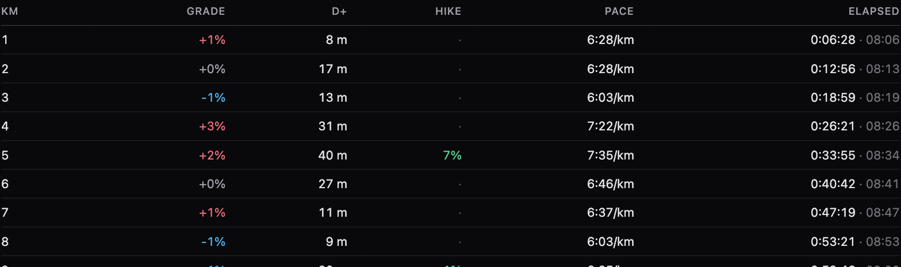
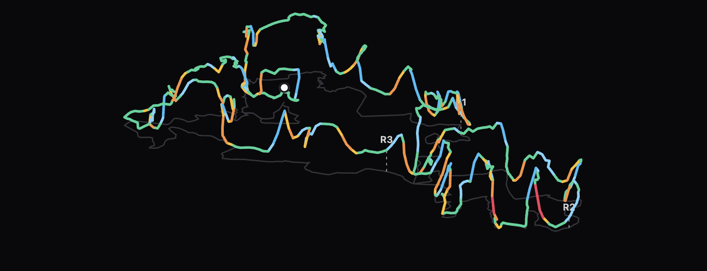

# GradePace

**Grade-adjusted pacing plans for trail races.** Upload a course GPX, get a
per-kilometer plan that knows steep climbs are power-hikes, not runs, and an
honest finish *range* instead of a false-precision single number. Everything
runs in your browser. Your GPX never leaves your device.

[](https://github.com/Alvaro5/grade-pace/actions/workflows/ci.yml)
[](./LICENSE)
[](https://gradepace.vercel.app)
[](#how-it-works)

### **[▸ Open the live app](https://gradepace.vercel.app)** &nbsp;·&nbsp; no signup, no upload, load an example and go

<p align="center">
  <a href="https://gradepace.vercel.app">
    
  </a>
</p>

---

## Why GradePace

Most pace planners assume you run every hill. On real trails, steep climbs are
power-hikes, and pretending otherwise makes every plan wrong from the first big
wall. GradePace is built around three ideas the mainstream tools skip:

- **Power-hikes are planned, not ignored.** Above a transition grade (default
  18%), iso-effort running is physically unavailable, so the plan switches to
  hiking at a fixed vertical speed (VAM). The elevation profile is colored by
  what you'll actually *do* — descent, runnable, climb, power-hike.
- **Self-calibration instead of guessed knobs.** Upload a run you recorded and
  GradePace inverts its own model against it: it *measures* your personal terrain
  factor (with stopped time filtered out) rather than asking you to invent one.
  Route exports with synthetic timestamps are detected and refused. This is the
  moat — Strava has the data to self-calibrate and doesn't.
- **Honest uncertainty.** Pre-race prediction can't beat day-of biology (sleep,
  heat, and fueling swing a 70 km race by 20–40 min). The finish is shown as a
  range — −8%/+10% uncalibrated, −5%/+7% once calibrated — with the model's
  central estimate in the middle. Admitting uncertainty is more state of the art,
  not less.

The [Minetti (2002)](https://doi.org/10.1152/japplphysiol.01177.2001) energy-cost
model is the foundation; the calibration layer is the product.

## See it

<table>
  <tr>
    <td width="50%"></td>
    <td width="50%"></td>
  </tr>
  <tr>
    <td>An <b>honest finish range</b>, a pace-sensitivity row, and the naive-planner contrast: "a flat-pace calculator would promise 6:52. This course makes it 7:43."</td>
    <td>A <b>grade-colored course map</b> (terrain / satellite / hybrid) with numbered distance markers, aid stations, opt-in POIs, and an animated race replay.</td>
  </tr>
  <tr>
    <td></td>
    <td></td>
  </tr>
  <tr>
    <td>The <b>key climbs</b>, C1..C7, where the race is decided: length, D+, average grade, the time each one takes, and when you'll hit it.</td>
    <td>A <b>nutrition plan</b> sizing carbs, fluids, sodium (and optional caffeine) per segment by projected time, not distance.</td>
  </tr>
  <tr>
    <td></td>
    <td></td>
  </tr>
  <tr>
    <td><b>Per-km (or per-mile) splits</b>: target pace, climb, hike share, elapsed and wall-clock time, all consistent with the projected finish.</td>
    <td>A hand-rolled <b>3D flyover</b> of the course (no three.js, ~5 kB) in the same grade colors, for studying the route before race day.</td>
  </tr>
</table>

Race logistics are part of the plan: a stop time per aid station (with
per-station overrides — `33(8)` means 8 minutes at that one), cutoff-barrier
warnings, wall-clock ETAs from your start time, and, within 16 days of your
race date, a race-day forecast that widens the slow end of the range when heat
is coming and suggests a fluid bump.

You can share a plan as an image, a link that carries your settings, a
printable race-day PDF, or a watch-ready GPX whose waypoints carry your
projected ETAs. The interface speaks English, French, Spanish, German, and
Italian.

## How it works

1. **Parse** — `<trkpt>` (or `<rtept>` fallback) → lat/lon/ele, plus optional
   timestamps for the calibration path.
2. **Distance** — cumulative Haversine.
3. **Resample** — even 10 m stations (kills gradient spikes from near-coincident
   GPS fixes).
4. **Smooth** — centered moving average over a fixed 30 m *physical* window.
5. **Gradient** — Δelevation / Δdistance per segment; D+ via a 5 m hysteresis
   deadband (density-stable, noise-robust).
6. **Cost → pace** — the Minetti energy-cost polynomial (clamped to its validated
   ±45% range) scales your flat pace; above the transition grade, segments
   hard-switch to power-hiking at fixed VAM.
7. **Plan** — aggregate into km or mile splits, project the finish, wrap it in the
   uncertainty range.

Calibration inverts the same forward model: predicted total (at terrain ×1.00) vs.
your actual *moving* time → a measured terrain factor, applied with one click.

## Getting started

```sh
npm install
npm run dev      # local dev server
npm run build    # production build (also what CI runs)
npm run test     # engine + app tests (Vitest, 158 tests)
npm run lint
```

Useful scripts (run with `npx tsx` — the engine uses extensionless TS imports):

```sh
npx tsx scripts/gen-og.mjs                              # regenerate og.png from the live share card
npx tsx scripts/render-card-preview.mjs a.gpx out.png   # preview the share card for any course
node scripts/calibrate-scan.ts efforts/*.gpx            # fit terrain factors across recorded runs
node scripts/prior-scan.ts efforts/*.gpx                # course-signal vs factor analysis (negative result)
```

## Project structure

```text
src/
  lib/pacing.ts        Pure engine: parse, distance, resample, smoothing,
                       gradients, Minetti cost, splits, moving time,
                       calibration fit, finish range. No React. Unit-tested.
  lib/format.ts        Time/pace formatters shared by UI and share card.
  lib/shareCard.ts     Shareable plan image as a self-contained SVG.
  lib/rasterize.ts     SVG → PNG in the browser.
  lib/gradeColor.ts    Shared grade→color scale (chart + map + share card).
  lib/basemaps.ts      Basemap catalog: terrain / standard / satellite / hybrid.
  lib/pois.ts          Overpass POIs (water, toilets, viewpoints): bbox query,
                       endpoint race, client-side route-corridor filter.
  lib/nutrition.ts     Nutrition plan: hourly carb/fluid/sodium targets applied
                       to each projected segment between aid stations.
  lib/logistics.ts     Race logistics: aid-station dwell time (per-station
                       overrides), wall-clock ETAs, cutoff-barrier warnings.
  lib/weather.ts       Race-day forecast (Open-Meteo) + heat adjustments:
                       slow-end range widening and a fluid-bump suggestion.
  lib/persistence.ts   Local save/restore of the last uploaded plan.
  lib/planSheet.ts     Printable race-day plan sheet (stats, profile, aid ETAs,
                       nutrition, full pacing table) for the PDF export.
  lib/planGpx.ts       Watch-ready GPX export: course track + aid waypoints
                       named with projected ETAs.
  lib/climbs.ts        Named-climb detection (hysteresis, relative dip
                       tolerance) behind the Key climbs card.
  lib/raceCompare.ts   Post-race check: recorded race vs the plan, drift
                       series and worst-stretch locator.
  lib/pseudo3d.ts      Projection math for the hand-rolled 3D course flyover
                       (orthographic camera, auto vertical exaggeration).
  App.tsx              UI: upload, effort inputs, calibration, share, table.
  ElevationChart.tsx   Grade-colored profile, hand-rolled SVG (lazy chunk).
  CourseMap.tsx        Map with the grade-colored route, aid stations, basemap
                       switcher, scale bar, opt-in POI overlay (lazy Leaflet).
  ErrorBoundary.tsx    Styled fallback instead of a white screen.
```

## Tech

Vite + React 19 + TypeScript, Tailwind v4, Leaflet, a hand-rolled SVG
chart, Vitest + Playwright. Installable PWA (the app shell works offline).
Client-side only — no backend, no database, no auth. Deployed on Vercel,
auto-deploy from `main`. The pure engine in `src/lib/pacing.ts` is the asset;
its Minetti anchors, clamp, and split invariants are locked by tests.

## Status & roadmap

Active development. Current technical state, decisions, and roadmap live in
[STATUS.md](./STATUS.md).

## Contributing

Issues and PRs welcome — see [CONTRIBUTING.md](./CONTRIBUTING.md). The short
version: keep the engine pure and tested, verify against reality (known race
lengths, published D+, the Minetti paper), and prefer honest uncertainty over
false precision.

## License

[MIT](./LICENSE) © Alvaro Serero

---

Built by [Alvaro Serero](https://x.com/AlvaroSerero) for his own race in the
Fontainebleau forest. If GradePace helps you plan yours, a ⭐ is appreciated.
